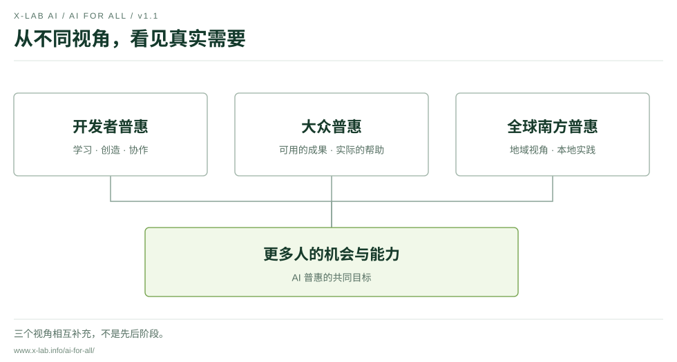
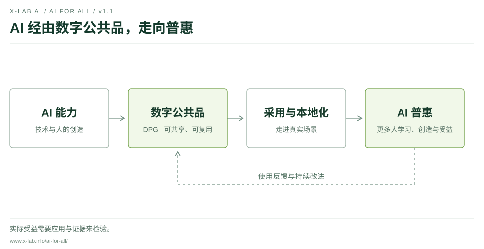
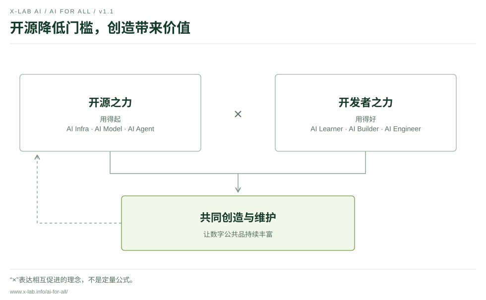
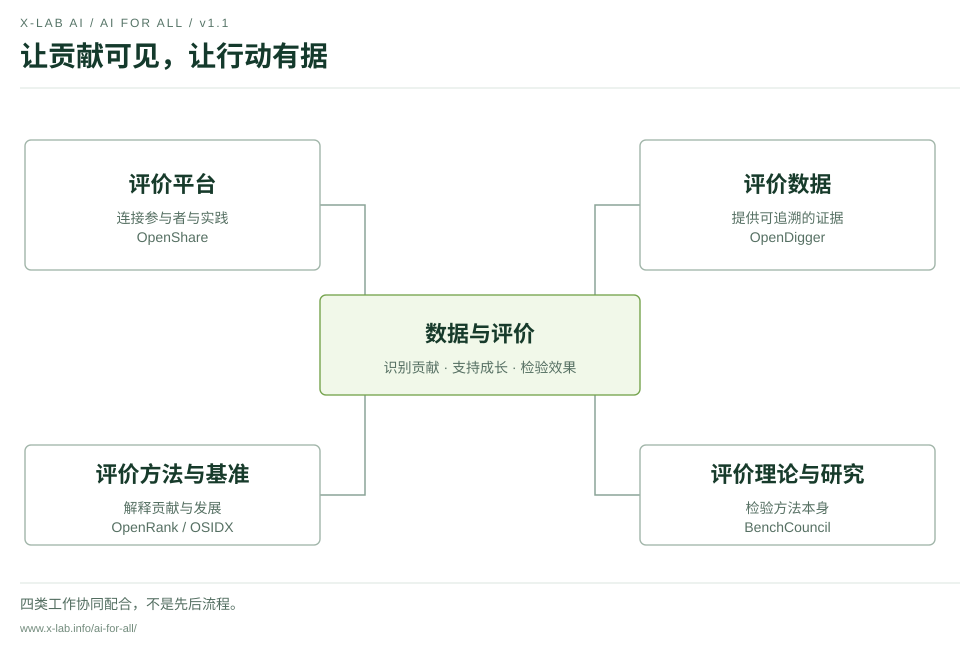
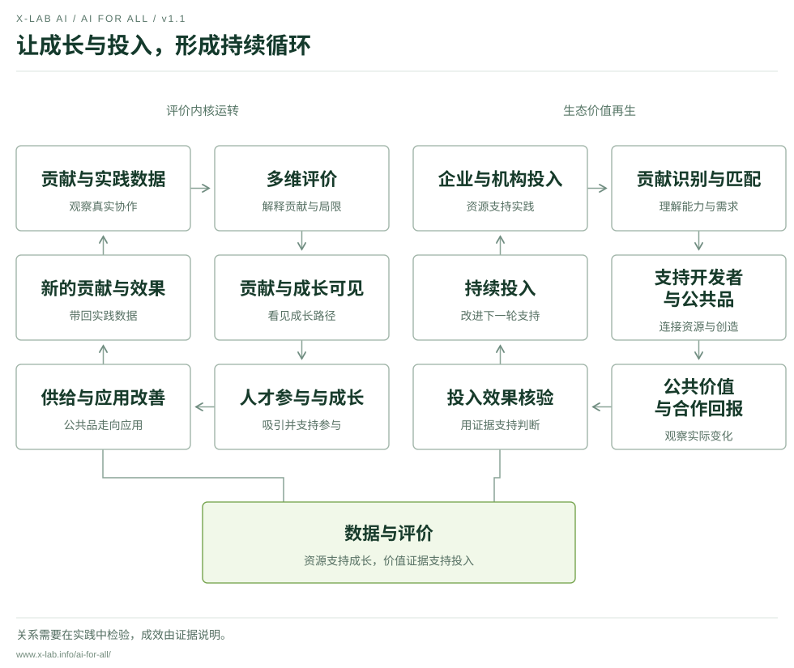

# AI 普惠宣言

## 让 AI 用得起，更用得好

**X-lab AI 开放实验室 · v1.1 · 2026 年 10 月 9 日**

[在线阅读](https://www.x-lab.info/ai-for-all/) · [English](translations/en.md) · [行动进展](PROGRESS.md) · [参与共建](CONTRIBUTING.md) · [修订记录](CHANGELOG.md)

<!-- manifesto:start -->
## 一、目标与对象

AI 正在改变人们获取知识、创造工具和解决问题的方式。工具的普及，让更多人有机会开始；持续使用的成本、学习的门槛和创造的能力，决定了这种机会能否转化为真实的帮助。

**让 AI 用得起，更用得好，是 X-lab AI 的长期目标。** 我们希望技术扩大人的选择，支持人的成长，让更多人能够学习、创造并改善实际处境。

我们从三个相互补充的视角理解普惠。**开发者普惠**是关键切入点，支持专业工程师，也支持正在学习、尝试构建工具的人。**大众普惠**关注成果的使用者，让公共品及其应用回应真实的生活与工作需要。**全球南方普惠**拓展地域视角，关注不同地区的语言、资源条件和发展机会，与当地伙伴共同探索适合的实践。

三重普惠体现了我们看待受益对象的多样性。它们不是互斥的人群，也不是必须依次完成的阶段。

<!-- diagram:start:inclusion-views -->

<!-- diagram:end -->

## 二、核心主张与路径

**AI 普惠 = 技术的普惠性（用得起）× 开发者的创造力（用得好）**

技术的开放与可获得性，帮助更多人进入；开发者的学习、判断与创造，让技术走向有意义的应用。乘法表达两股力量相互促进的理念，不是用于计算成效的定量公式。

**我们的路径是：AI → DPG（数字公共品）→ AI 普惠。** 开发者利用 AI 创造和维护可共享的工具、知识与解决方案，让数字公共品经过复用、采用和本地化，转化为更多人能够获得的帮助。

数字公共品可以包括开放的软件、AI 系统、数据和知识内容。我们重视开放许可、可复用性、公共价值与负责任的使用，并参考数字公共品标准持续改进。具体成果是否符合相应标准，应有可核验的依据。

公共品需要有人维护，也需要进入真实场景。我们将持续追问：谁在使用？是否负担得起、理解得了、用得起来？哪些人仍然没有受益？

<!-- diagram:start:goal-path -->

<!-- diagram:end -->

## 三、两股力量

**开源之力，降低门槛。** 从 AI 基础设施、模型到智能体与应用，开放的技术和知识让学习、改进与复用成为可能。我们支持清晰的许可、可理解的文档和持续维护，关注获取技术与长期使用的实际成本。

**开发者之力，放大创造。** 从 AI Learner 的学习探索，到 AI Builder 的应用构建，再到 AI Engineer 的工程实践，不同阶段的人都可以在真实问题中成长。学习、作品、协作和反馈相互连接，让知识逐渐转化为解决问题的能力。

开源项目与社区是两股力量相遇的地方。技术降低进入门槛，更多人的实践又带来新的工具、知识和维护力量，共同丰富数字公共品。人的判断力、责任意识与创造力，是这一过程的重要部分。

<!-- diagram:start:dual-forces -->

<!-- diagram:end -->

## 四、共同内核

**数据与评价，是连接两股力量、支持两个飞轮运转的共同内核。** 我们希望让贡献被看见，让成长有依据，让资源支持更有针对性，并让行动效果接受检验。

这一内核包含四类相互配合的工作：平台连接参与者与实践，数据提供可追溯的证据，评价方法与基准帮助解释贡献，评价研究检验方法本身。它们共同服务于决策与改进，不构成机械的先后流程。

我们的实践基础包括 OpenDigger 的开源数据与指标工作、OpenRank 的协作网络评价方法，以及 OpenShare 对贡献、能力和资源的连接探索。OSIDX 的发展指数工作与 BenchCouncil 的评价科学研究，为基准和方法提供进一步参考。具体项目与公开材料见行动进展。

评价应当帮助人和社区成长。代码、文档、维护、教学、翻译和社区协作都值得被看见。我们将说明数据覆盖与方法的局限，尊重参与者的知情与选择，为质疑、纠错和改进提供渠道，不以单一分数定义人的价值。

<!-- diagram:start:evaluation-core -->

<!-- diagram:end -->

## 五、两个飞轮

**评价内核的运转机制，连接人才成长与供给改善。** 贡献与实践数据进入多维评价，让贡献与成长更可见，吸引和支持更多人才参与；人才在实践中成长，推动公共品供给与应用改善；新的贡献和效果数据回到评价，形成下一轮学习与改进。

**生态价值再生机制，连接资源投入与持续支持。** 企业和机构投入资源，通过贡献识别与资源匹配支持开发者和公共品；实践产生可核验的公共价值与合作回报，为后续投入提供依据，让支持能够持续。

两个飞轮共用数据与评价内核。资源支持人才与供给，人才与供给创造实际价值，价值证据帮助改进投入。我们将用实践检验这些关系，公开进展、局限和调整。

合作可以带来人才交流、技术应用、生态洞察和公共价值成果。参与者应有自主选择，合作应明确责任、资源条件与数据使用方式。合理回报需要证据，持续投入需要各方共同维护。

<!-- diagram:start:twin-flywheels -->

<!-- diagram:end -->

## 六、行动承诺与邀请

**开放资源，让更多人能够开始。** 我们将推动可共享的工具、课程、案例和实践经验，为初学者保留进入机会。已有贡献不应成为获得基础学习机会的唯一条件。

**支持创造，让能力在实践中生长。** 我们鼓励从真实问题出发的学习、项目和社区协作，重视理解工具、检验证据、判断输出和承担责任的能力。

**公开记录，对实际效果负责。** 我们将区分计划、试点与已完成事项，说明行动目标、参与条件与支持边界。结合证据与使用者反馈，记录谁获得了什么帮助、哪些问题仍未解决，以及下一步如何改进。

我们邀请开发者分享问题、贡献工具与知识；邀请企业、教育机构和公共机构提供资源与实践机会；邀请国际组织、社区和各地区伙伴分享经验，共同建设适合不同需求的数字公共品。不同意见同样是共建的一部分。

**一个目标、两股力量、一个内核、两个飞轮、三重普惠。** 我们将以公开记录连接愿景与行动，让实践持续检验这份承诺。

**以开放连接智慧，以 AI 拓展认知。**
<!-- manifesto:end -->

---

## 从宣言走向行动

第一项行动是宣言公开共建。欢迎通过 [Issues](https://github.com/X-lab2017/ai-for-all/issues) 提出建议、行动提案与实践反馈。项目入口、行动状态和证据见 [行动进展](PROGRESS.md)。

本版根据 [Issue #2](https://github.com/X-lab2017/ai-for-all/issues/2) 的方案讨论及[专家评审](https://github.com/X-lab2017/ai-for-all/issues/2#issuecomment-6071564956)重构。中文正文为权威版本，英文同步维护，网站由正文自动生成。

[五幅图解与下载](site/assets/diagrams/README.md) · [参与指南](CONTRIBUTING.md) · [术语与来源](SOURCES.md) · [许可说明](NOTICE.md) · [v1.0 历史版本](https://github.com/X-lab2017/ai-for-all/releases/tag/v1.0.0) · [品牌资源](https://github.com/X-lab2017/xlab-ai-brand)
