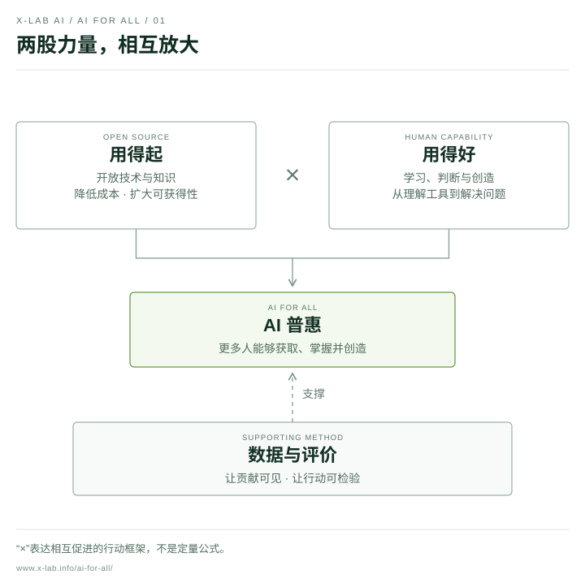
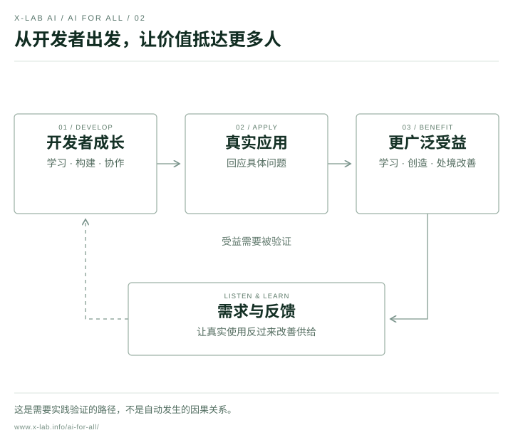
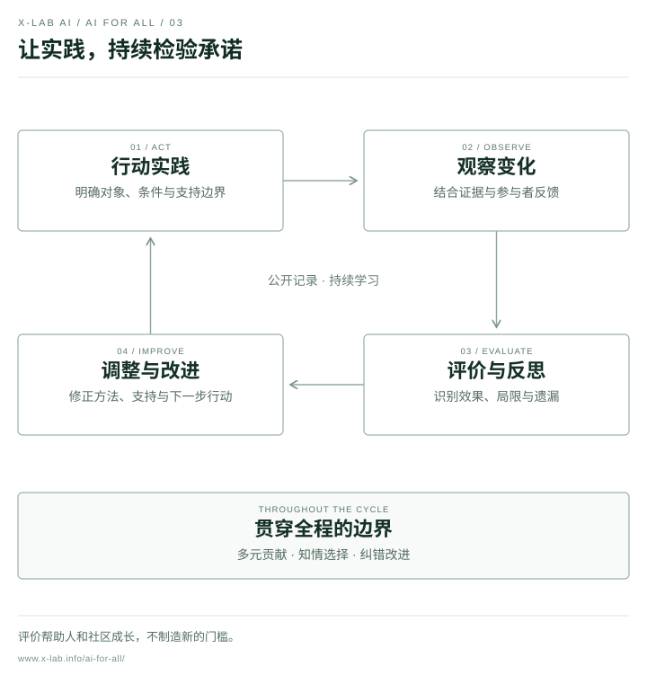

# 宣言理念图解

图解来自《X-lab AI 普惠宣言》v1.0，帮助解释主张、受益路径与行动循环。宣言正文措辞保持不变。

[在线交互版本](https://www.x-lab.info/ai-for-all/#access-capability)

| 图解 | 中文 SVG | 中文 PNG | English SVG | English PNG |
| --- | --- | --- | --- | --- |
| 两股力量，相互放大 | [SVG](access-capability-zh.svg) | [PNG](access-capability-zh.png) | [SVG](access-capability-en.svg) | [PNG](access-capability-en.png) |
| 从开发者出发，让价值抵达更多人 | [SVG](path-to-benefit-zh.svg) | [PNG](path-to-benefit-zh.png) | [SVG](path-to-benefit-en.svg) | [PNG](path-to-benefit-en.png) |
| 让实践，持续检验承诺 | [SVG](learning-loop-zh.svg) | [PNG](learning-loop-zh.png) | [SVG](learning-loop-en.svg) | [PNG](learning-loop-en.png) |

SVG 适合放大与排版，PNG 适合演示与文章。使用边界见 [NOTICE](../../../NOTICE.md)。图解中的关系是行动框架，不是定量预测或已验证的成效。

