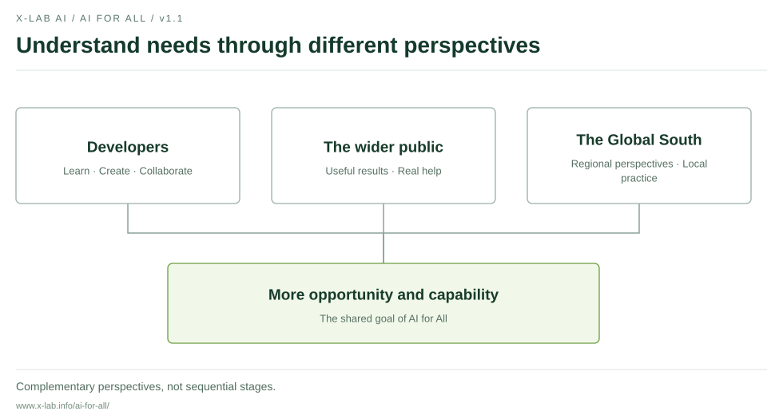
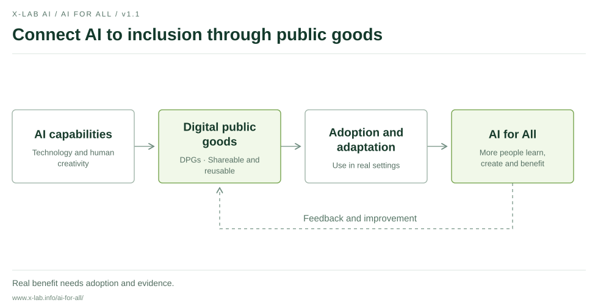
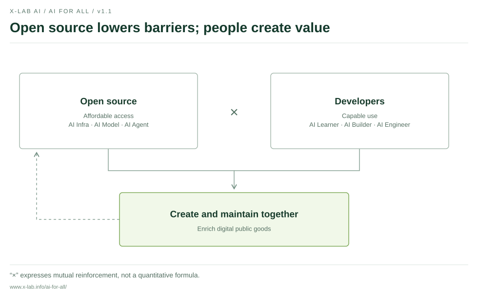
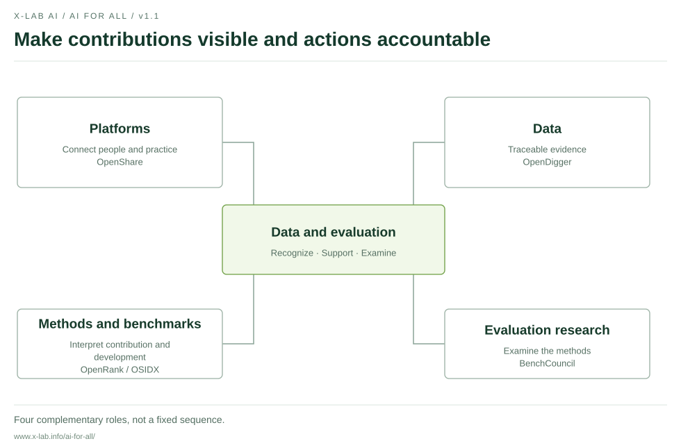
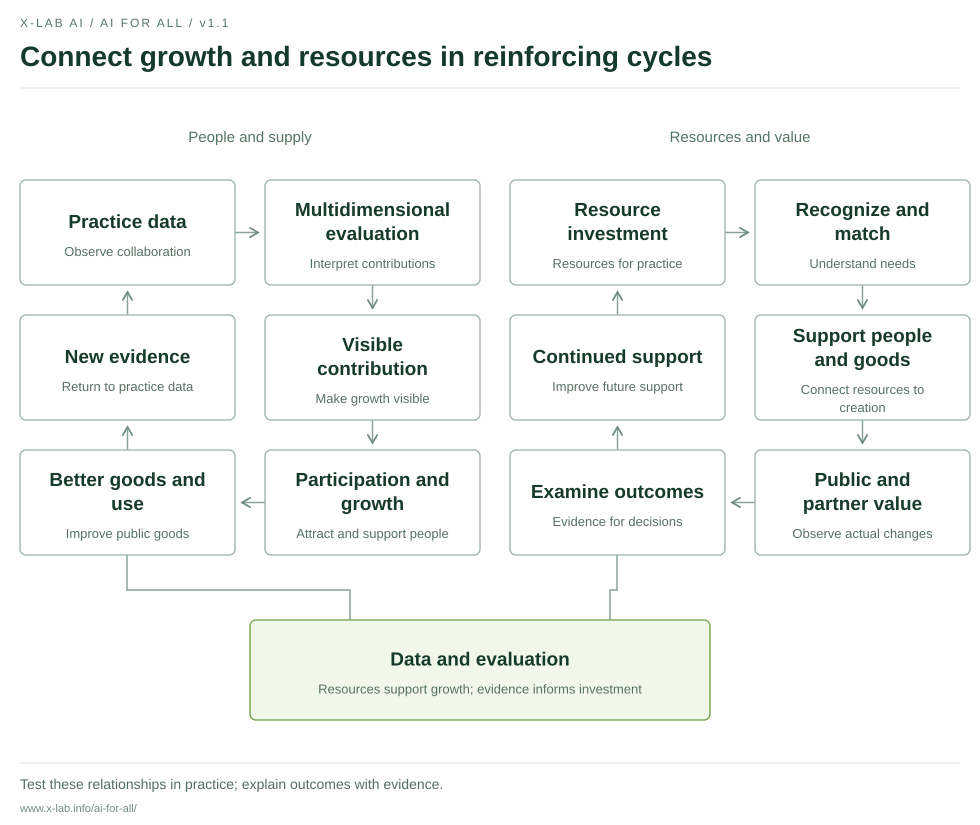

# AI for All Manifesto

## Make AI affordable and useful

**X-lab AI Open Laboratory · v1.1 · 9 October 2026**

[Read online](https://www.x-lab.info/ai-for-all/en.html) · [中文](../README.md) · [Progress](../PROGRESS.md) · [Contribute](../CONTRIBUTING.md)

<!-- manifesto:start -->
## 1. Our goal and the people it serves

AI is changing how people access knowledge, create tools and solve problems. Wider access gives more people an opportunity to begin. The cost of sustained use, barriers to learning and the ability to create determine whether that opportunity becomes real help.

**Making AI affordable and useful is X-lab AI’s long-term goal.** We want technology to expand people’s choices, support their growth and help more people learn, create and improve their circumstances.

We approach inclusion through three complementary perspectives. **Developer inclusion** is a key starting point, supporting professional engineers as well as people learning and trying to build tools. **Public inclusion** focuses on those who use the results, so public goods and their applications address real needs in life and work. **Global South inclusion** broadens the geographic perspective, attending to languages, resource conditions and development opportunities, and exploring appropriate practice with local partners.

These perspectives reflect the diversity of people and needs we seek to understand. They are neither mutually exclusive groups nor stages that must be completed in sequence.

<!-- diagram:start:inclusion-views -->

<!-- diagram:end -->

## 2. Our proposition and path

**AI for All = Accessible technology (affordable access) × Developer creativity (capable use)**

Open, accessible technology helps more people participate. Developers’ learning, judgment and creativity turn technology into useful applications. Multiplication expresses mutual reinforcement; it is not a quantitative formula for measuring impact.

**Our path is AI → DPGs (digital public goods) → AI for All.** Developers use AI to create and maintain shareable tools, knowledge and solutions. Reuse, adoption and local adaptation turn these public goods into help that more people can access.

Digital public goods can include open software, AI systems, data and knowledge collections. We value open licensing, reuse, public value and responsible use, and draw on the Digital Public Goods Standard to improve our work. Claims that a particular solution meets a standard should have verifiable evidence.

Public goods need maintenance and real-world use. We will keep asking who uses them, whether they are affordable, understandable and usable, and who still does not benefit.

<!-- diagram:start:goal-path -->

<!-- diagram:end -->

## 3. Two forces

**Open source lowers barriers.** From AI infrastructure and models to agents and applications, open technology and knowledge enable learning, improvement and reuse. We support clear licensing, understandable documentation and sustained maintenance, while attending to the real cost of access and continued use.

**Developers expand what people can create.** AI Learners explore, AI Builders develop applications, and AI Engineers put systems into practice. People at different stages can grow through real problems. Learning, useful work, collaboration and feedback help turn knowledge into problem-solving capability.

Open-source projects and communities bring these forces together. Technology lowers barriers to entry; more people contribute tools, knowledge and maintenance, enriching digital public goods. Human judgment, responsibility and creativity are essential to this process.

<!-- diagram:start:dual-forces -->

<!-- diagram:end -->

## 4. A shared core

**Data and evaluation connect the two forces and support both reinforcing cycles.** We aim to make contributions visible, ground support for growth in evidence, direct resources where they help and examine the effects of our actions.

The core brings together four kinds of work. Platforms connect participants and practice. Data provide traceable evidence. Methods and benchmarks help interpret contributions. Evaluation research examines the methods themselves. They work together to support decisions and improvement, rather than forming a fixed sequence.

Our practical foundations include OpenDigger’s open-source data and metrics, OpenRank’s collaboration-network evaluation methods, and OpenShare’s exploration of connections among contributions, capabilities and resources. Work on the OSIDX development index and BenchCouncil’s evaluation science research provide further references for benchmarks and methods. Project links and public materials appear in the progress record.

Evaluation should help people and communities grow. Code, documentation, maintenance, teaching, translation and community collaboration all deserve recognition. We will explain limits in data coverage and methods, respect informed choice, and provide channels for questions, corrections and improvement. A single score cannot define a person’s worth.

<!-- diagram:start:evaluation-core -->

<!-- diagram:end -->

## 5. Two reinforcing cycles

**The evaluation cycle connects talent development with better supply.** Contribution and practice data inform multidimensional evaluation, making contributions and growth more visible and attracting and supporting more participants. People grow through practice and improve public goods and their applications. New contribution and outcome data inform the next round of evaluation, learning and improvement.

**The ecosystem value cycle connects resources with sustained support.** Businesses and institutions contribute resources. Contribution recognition and resource matching support developers and public goods. Practice generates verifiable public value and benefits for partners, providing evidence for continued investment.

Both cycles share the data and evaluation core. Resources support people and supply; people and supply create real value; evidence of that value helps improve resource decisions. We will test these relationships in practice and report progress, limitations and adjustments.

Partnerships can bring talent exchange, technology adoption, ecosystem insights and public value. Participants should retain freedom of choice. Partnerships should clarify responsibilities, resource conditions and data use. Reasonable returns need evidence, and continued support requires shared stewardship.

<!-- diagram:start:twin-flywheels -->

<!-- diagram:end -->

## 6. Commitments and invitation

**Open resources so more people can begin.** We will advance shareable tools, courses, examples and practical knowledge, preserving entry opportunities for beginners. Prior contribution should not be the sole condition for access to basic learning opportunities.

**Support creation so capability grows through practice.** We encourage learning, projects and community collaboration grounded in real problems, and value the ability to understand tools, examine evidence, assess outputs and take responsibility.

**Keep public records and take responsibility for outcomes.** We will distinguish plans, pilots and completed work, and explain goals, participation conditions and the limits of support. Combining evidence with user feedback, we will record who received what help, which problems remain and how our actions should improve.

We invite developers to share questions, tools and knowledge; businesses, educational institutions and public bodies to offer resources and practical opportunities; and international organizations, communities and regional partners to share experience and build digital public goods for different needs. Disagreement is also part of co-creation.

**One goal. Two forces. One shared core. Two reinforcing cycles. Three perspectives on inclusion.** We will connect vision with action through public records and let practice continually test this commitment.

**Connect knowledge through openness. Expand understanding with AI.**
<!-- manifesto:end -->

---

The Chinese text is authoritative. This translation and the website are maintained alongside it. See [Issue #2](https://github.com/X-lab2017/ai-for-all/issues/2) for the review, [sources](../SOURCES.md) for public references, and [permissions](../NOTICE.md) for reuse terms.
