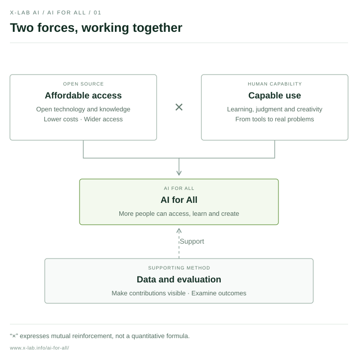
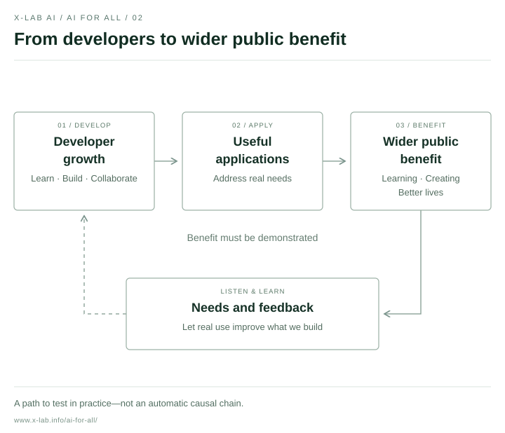
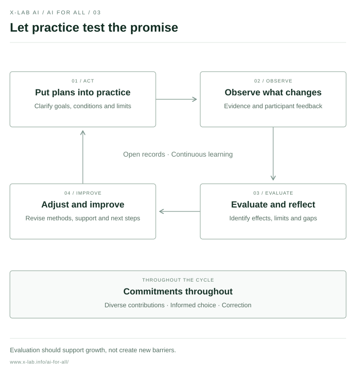

# The X-lab AI Manifesto for AI for All

## Making AI affordable—and enabling people to use it well

**Lower barriers through open source. Unlock creativity through growth.**

X-lab AI Open Laboratory · v1.0 release · 8 October 2026

[中文](../README.md) · [Action progress](../PROGRESS.md) · [Contributing](../CONTRIBUTING.md)

<!-- manifesto:start -->
## 1. Our vision

AI is changing how people access knowledge, create tools and solve problems. But widespread access to tools does not necessarily mean widespread capability. Being able to try AI does not mean being able to afford sustained use; having a tool does not mean being able to understand it, exercise judgment and apply it to real life and work.

We envision a future in which more people can access AI and develop the ability to choose, understand and create with it. Wherever people live and wherever they are in their learning journey, they should have opportunities to participate in this change, rather than simply experience its consequences.

X-lab AI therefore adopts a long-term direction: making AI affordable—and enabling people to use it well. Affordability involves cost, availability and opportunities to get started. Effective use involves knowledge, judgment, creativity and the ability to solve real problems.

The value of inclusion lies not only in how many people open a tool, but in whether it helps them learn, create something meaningful and improve their circumstances. Technological progress should expand people's choices, support their growth and serve their dignity.

<!-- diagram:start:access-capability -->

<!-- diagram:end -->

## 2. Our path

We believe open source and human development can reinforce each other. Open technology and knowledge lower barriers to participation; learning and practice bring new tools, experience and contributions back to open communities.

We begin with developers. By developers, we mean both professional engineers and people learning to build tools and solve problems. Helping them access resources, develop capabilities and create useful work is a concrete way to extend AI's benefits to more users.

But developer growth does not automatically create public benefit. We will keep asking whom these tools serve, whether they are understandable, affordable and usable, and whether they address real needs. We will also attend to people and regions with fewer resources. Working with partners in the Global South, we will seek to understand local languages, cultures and conditions and support locally appropriate practice, rather than treating one experience as a universal answer.

Data and evaluation support this path. Through explainable data and continuously improved evaluation, we aim to make different kinds of contribution visible, inform resource allocation and examine the effects of our actions. Evaluation should help people and communities grow, rather than create new barriers.

<!-- diagram:start:path-to-benefit -->

<!-- diagram:end -->

## 3. Our actions and commitments

**Open resources and knowledge, so more people can begin.** We will advance shareable tools, courses, examples and practical knowledge, and explore support that reduces the cost of learning and use. We will preserve entry opportunities for beginners while recognizing and supporting sustained contribution. Prior contribution should not be the sole condition for access to basic learning opportunities.

**Support learning and creation, so capability grows through practice.** We will encourage learning, collaboration and projects grounded in real problems, helping participants move from understanding tools to building applications and improving them through user feedback. We value technical skills alongside the ability to assess outputs, ask for evidence, recognize limitations and take responsibility. AI can participate in thinking; it should not become a reason to stop thinking.

**Make contributions visible, and keep evaluation open to scrutiny.** Code, documentation, maintenance, teaching, translation, community collaboration and user feedback can all create significant value. We will not define a person's worth by a single score or equate measurable activity with all contribution. We will explain evaluation methods and their limitations, provide channels for questions, corrections and improvement, and respect informed choice about the use of personal data.

**Report progress openly and take responsibility for actual outcomes.** We will explain goals, participation conditions and the limits of support, distinguishing plans, pilots and completed work. We will not present aspirations as achievements. Combining evidence with participant feedback, we will examine who received what help, which problems remain and how our actions should change. We will be honest about effects that have not been demonstrated and explain and improve upon commitments we have not fulfilled.

We welcome businesses, public bodies, educational institutions and communities to contribute knowledge, technology, resources and opportunities, and to explore sustainable support for inclusion. Partnerships should respect participants' freedom of choice, clarify responsibilities and avoid exchanging support for opaque data use or unreasonable conditions.

<!-- diagram:start:learning-loop -->

<!-- diagram:end -->

## 4. Our invitation

AI for all requires sustained practice and many forms of participation.

If you are learning, bring your questions, difficulties and experiences. If you are creating, contribute tools, knowledge and practical lessons. If you can provide resources, join us in exploring open, clear and sustainable ways to support others. If you see shortcomings, bring your disagreements and help us revise our judgments.

We do not consider this manifesto a finished answer. It is X-lab AI's public commitment to a direction and an invitation to participate. We will connect vision with action through public records and let practice continually test this commitment.

**Connect knowledge through openness. Expand understanding with AI.**

**X-lab AI: lower barriers through open source, unlock creativity through growth, and make AI affordable—and useful—for more people.**
<!-- manifesto:end -->

The Chinese text is authoritative. This translation is maintained alongside it. Our first action is an open discussion of this manifesto; see the Chinese [progress record](../PROGRESS.md) and [contribution guide](../CONTRIBUTING.md). Content and brand permissions are described in [NOTICE.md](../NOTICE.md).
